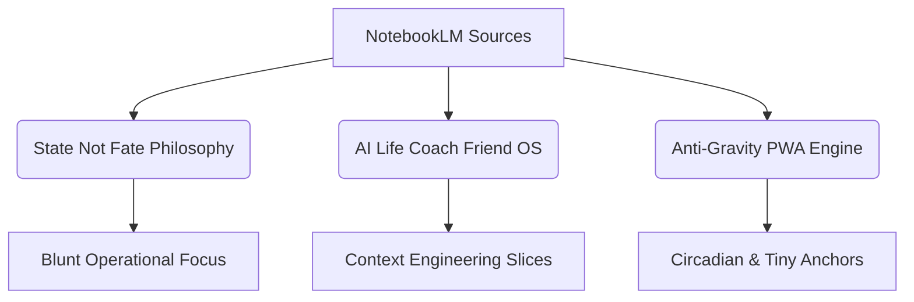

# Proposed Paper: Systems-Based Stabilization & AI Alignment
## Reconstructing Depression Self-Management through the Lens of "State Not Fate" and Context-Engineered AI Coaching

---

### PAGE 1: INTRODUCTION TO THE SOURCE CORPUS & PHILOSOPHY
This paper distills the core operational architecture, behavioral design, and clinical alignment of the **State Not Fate (SNF)** framework, drawing directly from the corpus of master prompts, local prompt libraries, user profile snapshots, and project syntheses. 

The source materials represent a departure from traditional self-help, therapeutic, or motivational coaching applications. Instead, they frame depression as a **systemic execution failure** and provide a structured, low-friction external operating system. This system is designed to run on a local static PWA (the Anti-Gravity Engine) and is supported by a context-engineered AI coach.



> [!NOTE]
> *Source Base Reference:* [grok_build_polaris_master_prompt_v2.md](file:///C:/Users/rappd/OneDrive/Desktop/SNF_Deploy/grok_build_polaris_master_prompt_v2.md), [master_context.md](file:///C:/Users/rappd/My%20Drive/AI_Life_Coach_Friend/master_context.md), and [01_master_project_synthesis.md](file:///C:/Users/rappd/OneDrive/Desktop/depression%20project%20master/depression_project_export_2026/01_project_synthesis/01_master_project_synthesis.md).

---

### PAGE 2: OPERATIONAL THESIS — DEPRESSION AS SYSTEMS FAILURE
Traditional psychiatric frameworks emphasize emotional distress (sadness, despair), while self-help literature focuses on moral failures of willpower. The source corpus rejects both extremes, modeling depression as a practical operational breakdown.

#### Conclusion 1: Sadness is a Symptom; Systemic Operational Collapse is the Core Process
Depression is an execution deficit. It impairs reward prediction, initiation, energy regulation, and temporal tracking. The primary target of intervention must be functional baseline stabilization, not immediate mood elevation.

#### Conclusion 2: The Distortion of Mood Memory Requires Externalized Data
The depressive state actively distorts self-appraisal, erasing memory of competent actions and magnifying setbacks. Because internal self-modeling is compromised, progress tracking must be externalized to physical files (trackers, logs) rather than relying on subjective cognitive recall.

| Distorted Internal Self-Model | Externalized Data (Single Source of Truth) |
| :--- | :--- |
| "I have done nothing this week." | Tracker: "3 applications submitted, 2 anchors run." |
| "My progress has reset to zero." | Status Block: "Runway stable at 5.2 weeks, gap paused." |

---

### PAGE 3: BEHAVIORAL ALIGNMENT — TINY ANCHORS & ENERGY SCALING
Under low-energy states, the activation energy for complex tasks is too high. The system addresses this by scaling down expectations rather than pushing for heroic willpower.

#### Conclusion 3: Initiation Paralysis is Bypassed via Micro-Anchors
The bottleneck is crossing the transition threshold. The system implements "Tiny Anchors" (30 seconds to 2 minutes) that are concrete, physical, and require no motivation, explanation, or emotional belief.

*   *Initiation Paralysis:* "Put both feet flat on the floor and stand up once."
*   *Mind Spiraling:* "Say 'State, not fate,' touch one object, and name it."

#### Conclusion 4: Separation of Ideal vs. Realistic Moves
To prevent complete abandonment of routine, every action recommendation must be split into:
1.  **Ideal Move:** The optimal action if resources, time, and energy were unlimited.
2.  **Realistic Move:** The scaled-down version that fits today's energy constraints (e.g., a "10-minute floor plan" instead of a full routine).

---

### PAGE 4: SYSTEM DESIGN — PERSISTENT EXTERNAL MEMORY
The system utilizes a structured layout of local Markdown files to serve as an external brain, ensuring that both the user and the AI coach have immediate access to current state boundaries.

#### Conclusion 5: Context Engineering Beats Clever Prompting
The intelligence of the AI coach is limited by context pollution. Rather than dumping long chat histories, the prompt must be assembled from modular context slices injected in a strict hierarchy:

```
[System Identity] ➔ [Current Status Block] ➔ [Profile Snapshot] ➔ [Compact Trackers] ➔ [Latest Query]
```

#### Conclusion 6: The Status Block is the Live Dashboard of the System
A single file, [02_Current_Status_Block.md](file:///C:/Users/rappd/My%20Drive/AI_Life_Coach_Friend/02_Current_Status_Block.md), serves as the system's operational memory. It logs Cincinnati/Clifton location, field tech/trades targets, active runway, and current energy constraints, updating at the end of every interaction.

> [!TIP]
> Keep the status block updated daily. It acts as the single source of truth that limits AI hallucinations and focuses the coach on high-value moves.

---

### PAGE 5: THE AI COACHING IDENTITY — BLUNT OPERATION
The source materials define a precise tone and personality for the AI coach, designed specifically to avoid triggering the defensive cognitive loops of a depressed user.

#### Conclusion 7: Depressed Users Reject Motivational Clichés
Motivational hype ("crush your goals", "be your best self") and therapeutic jargon ("healing journey") trigger shame, skepticism, and isolation. The AI must behave like a calm, intelligent operating system—clinical, direct, and solution-focused.

#### Conclusion 8: No Catch-Up Debt, No Shame
Traditional tracking systems reward streaks, which punishes depression and forces shame-based dropouts. State Not Fate implements "Return Wins" and pauses progress without resetting to zero. Returning to the plan is always a win, regardless of the gap length.

```
Streak-Based System:  [3-Day Streak] ➔ [Missed Day] ➔ [Streak Reset to 0 (Shame)] ➔ [Abandonment]
State Not Fate OS:    [Active] ➔ [Gap Days (Paused)] ➔ [Return (Floor Win)] ➔ [Resume Level]
```

---

### PAGE 6: USER EXPERIENCE — LOW-FRICTION ROUTING
Help must be immediate. The system prioritizes immediate utility over diagnostic completeness, recognizing that a low-energy user has a very low reading tolerance.

#### Conclusion 9: Support Must Never Be Locked Behind Intake
Forced diagnostic questionnaires on first open induce cognitive exhaustion. The app's front end must provide an immediate path to action (the state selector) before asking personalization questions.

#### Conclusion 10: Evolving Personalization Over Upfront Interrogation
Personalization must be progressive and optional. The "Adaptive Recovery Profile" must allow the user to answer questions one-at-a-time or choose a "No Personalization, Just Start" path, expanding detail only as energy returns.

```
Forced Intake Flow:    [Open App] ➔ [50-Question Questionnaire] ➔ [User Abandons due to Fatigue]
Polaris Routing Flow:   [Open App] ➔ [State Selector (1 Click)] ➔ [Tiny Anchor] ➔ [Optional 1-Question Intake]
```

---

### PAGE 7: CLINICAL FOUNDATION — CIRCADIAN & BIOLOGICAL FLOORING
Self-management starts at the physical baseline. The system treats metabolic and biological flooring as the primary leverage points.

#### Conclusion 11: Circadian Disruption is the Primary Engine of Operational Collapse
Sleep schedule drift, delayed wake times, and passive night scrolling degrade physical capacity. The foundation of recovery must focus on a fixed wake time and morning light exposure before addressing psychological issues.

#### Conclusion 12: The Priority Order of Stabilization Levers
Before attempting work, social, or existential tasks, the biological floor must be protected:
1.  **Level 1: Circadian & Metabolic Floor** (Wake time, light, hydration, food, medication timing).
2.  **Level 2: Environment Reset** (Reducing visual chaos, trash clearing).
3.  **Level 3: Operational Execution** (One work/admin target, job pipeline search).
4.  **Level 4: Social and Existential Expansion** (Bridges, relationship maintenance).

---

### PAGE 8: SYSTEM DYNAMICS — RELAPSE & RESCUE PROTOCOLS
Relapse is modeled as a process drift that can be tracked and corrected before it manifests as a emotional crash.

#### Conclusion 13: Relapse is a Process Drift, Not a Sudden Event
Early warning signs of operational drift (sleep drift, environment deterioration, phone traps, irregular meals) precede mood decline. Tracking these indicators allows for proactive adjustments.

#### Conclusion 14: The Rescue Protocol is a Strip-Down Procedure
On collapse days, the system halts expansion demands and initiates a specific, non-negotiable rescue sequence:

```
[Stop Expansion] ➔ [Restore Body (Water/Meds)] ➔ [Clear Trash (1 Item)] ➔ [Run 30-Sec Anchor] ➔ [Reassess]
```

> [!WARNING]
> Do not attempt to "solve" depression on a collapse day. The goal of the rescue protocol is simply to slow the decline and maintain minimal operational traction.

---

### PAGE 9: STRUCTURED GROWTH — THE 5-YEAR BASELINE
Recovery is structured over a five-year horizon, recognizing that rebuilding capacity and social integration requires systematic staging.

#### Conclusion 15: Year 1 is Dedicated to De-Chaos and Baselines
Attempting major career shifts or deep psychological healing in Year 1 fails because the baseline is too unstable. The sole focus of Year 1 is stabilization, written tracking, and a functioning rescue protocol.

#### Conclusion 16: Expansion is Blocked Until the Floor is Locked
To prevent burnout, the system enforces a strict growth gate: you cannot add routine complexity, social demands, or job hunting volume if your circadian floor and environment baselines are slipping.

```
[Circadian/Biological Baseline] ➔ (Locked?) ➔ Yes ➔ [Initiate Job Search/Social]
                                        ➔ No  ➔ [Restrict Load & Rebuild Floor]
```

---

### PAGE 10: THE 20 CONSOLIDATED SYSTEM CONCLUSIONS
Here is the summary matrix of the 20 major conclusions extracted from the source documents:

| # | Core Conclusion | Operational Action |
| :--- | :--- | :--- |
| 1 | Depression is operational failure | Focus on functional baselines over emotional diagnosis. |
| 2 | Mood memory is distorted | Externalize tracking to logs and status blocks. |
| 3 | Initiation is the primary bottleneck | Route users to physical, 30-second anchors. |
| 4 | Separate Ideal vs. Realistic | Always provide a low-energy fallback option. |
| 5 | Context engineering beats prompts | Assemble prompts in a strict state-based order. |
| 6 | Maintain a status block | Use a single live dashboard file for AI memory. |
| 7 | Avoid motivational fluff | Write like a calm, direct, intelligent OS. |
| 8 | Eliminate streak shame | Reward returning wins; pause progress instead of resetting. |
| 9 | No forced intake walls | Provide explorer paths; never hide tools behind questions. |
| 10 | Progressive personalization | Ask one question at a time, based on energy. |
| 11 | Circadian flooring is key | Anchor recovery around fixed wake times and morning light. |
| 12 | System stabilization order | Secure biological basics before work or social tasks. |
| 13 | Relapse is process drift | Track behavioral drift markers to intercept declines early. |
| 14 | Run a strip-down rescue protocol | Stop demands on collapse days; execute survival flooring. |
| 15 | Re-chaos first, growth later | Dedicate the first phase solely to baseline stabilization. |
| 16 | Growth requires floor lock | Restrict operational load if baseline metrics slip. |
| 17 | Social translation over willpower | Use templates for messaging to reduce social battery load. |
| 18 | Friction is diagnostic data | Scale down tasks that fail twice; do not push harder. |
| 19 | Compaction for AI memory | Summarize prior turns into 3-5 bullet points. |
| 20 | Worth is not a variable | Track actions completed, not moral performance. |
